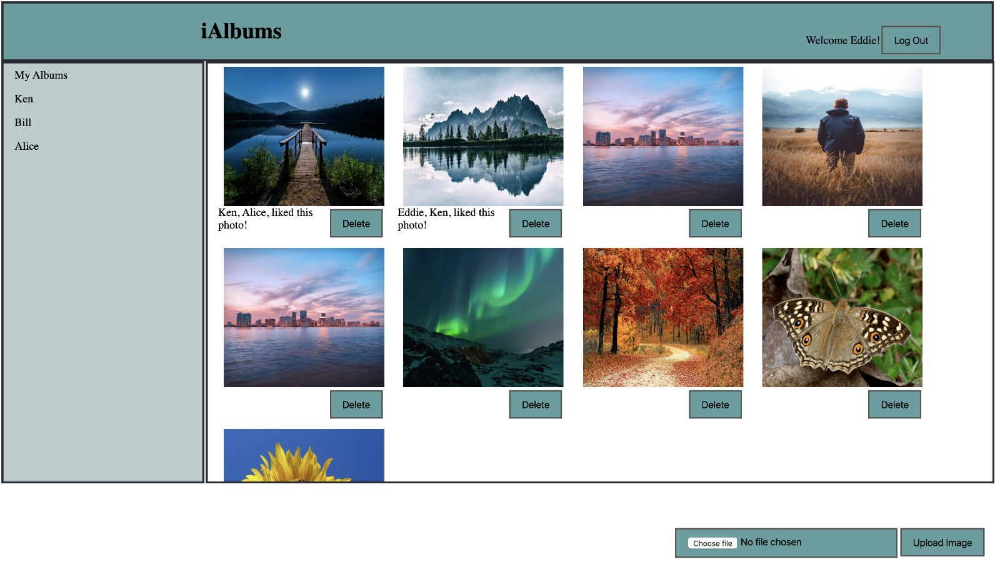

# iAlbums-MERN-Stack

MongoDB - Express JS - React - Node JS

  

This Application performs the following functions - 

1. User Login / Logout
2. Upload Images
3. View Friends Images
4. Delete current user's Images
 
Run Database (MongoDB):

`cd iAlbums-MERN-Stack`

`mkdir data`

`./bin/mongod --dbpath YourPath/iAlbums-MERN-Stack/data`

`./bin/mongo`

Populate the database - 

`db.userList.insert({'username': 'Eddie', 'password': '123456', 'friends':['Ken', 'Alice', 'Bill']})`

`db.photoList.insert({'url': 'http://localhost:3002/uploads/1.jpg', 'userid': 'xxxxxxx', 'likedby':['Ken', 'Alice']})`

Run Backend Server (Express):

`node app.js`

Run Application (React):

`npm start `